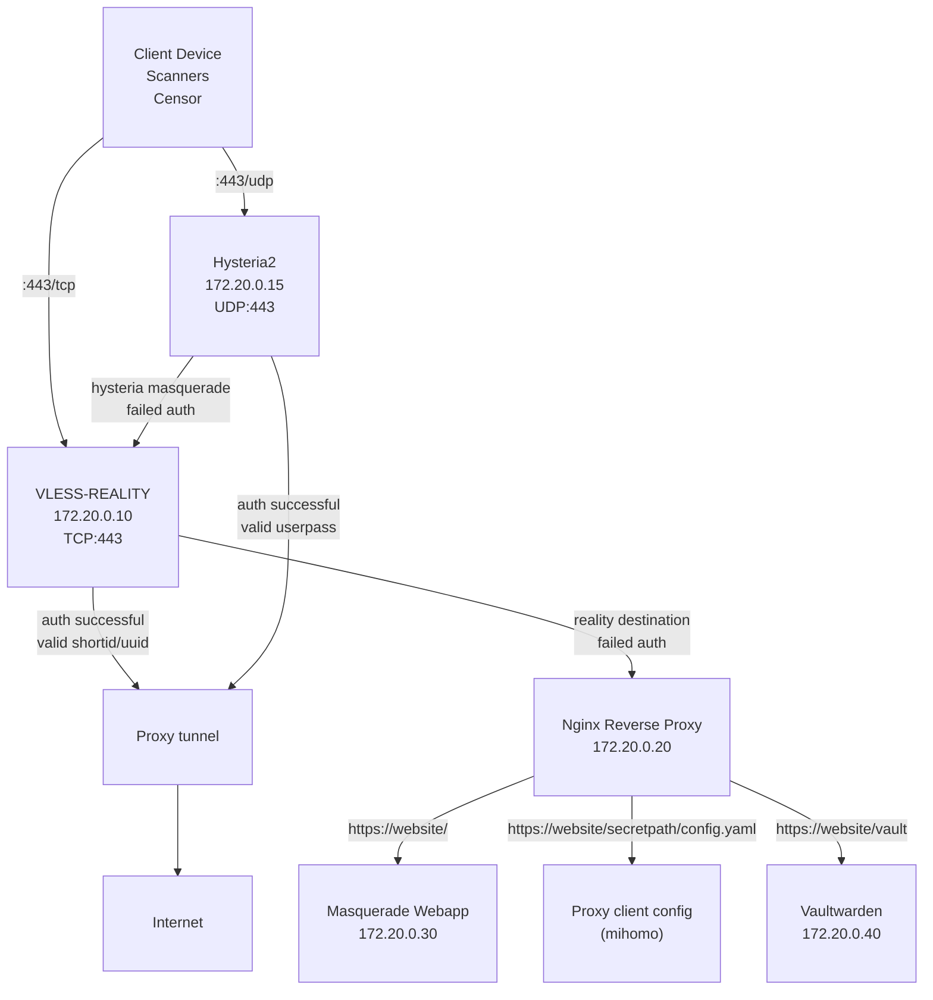

<a href="https://github.com/user-attachments/assets/193315b6-0143-4289-bbbd-fdb28540fec4">
  
<a>
<i>
Ведь больше нет никого<br>
Ничего-ничего<br>
Смерть подставит плечо<br>
Жизнь выставит счет<br>
И за дверь<br>
Ты уходишь<br>
И вроде бы и не жил<br>
Лишь только снег кружит<br>
</i>
<br clear="right"/>

## (not only) cheburnet

##### ubuntu server init
```sh
IU_SSH_KEY="key" IU_CERT_EMAIL="email" IU_CERT_DOMAIN="domain" bash <(wget -qO- https://raw.githubusercontent.com/vargalott/cheburnet/main/.ubuntu/init.sh)
```

##### check tools
```sh
bash <(wget -qO- ip.check.place) -l en
bash <(wget -qO- check.unlock.media) -E en -R 0
bash <(wget -qO- bench.sh)
bash <(wget -qO- nws.sh)
bash <(wget -qO- https://raw.githubusercontent.com/vernette/censorcheck/master/censorcheck.sh)
bash <(wget -qO- https://raw.githubusercontent.com/vernette/ipregion/master/ipregion.sh)
```

##### misc
```sh
# uuid, PVT+PBK
docker run --rm ghcr.io/xtls/xray-core uuid
docker run --rm ghcr.io/xtls/xray-core x25519
# OR
docker run --rm ghcr.io/sagernet/sing-box:latest generate uuid
docker run --rm ghcr.io/sagernet/sing-box:latest generate reality-keypair

# shortid
openssl rand -hex 8

# certificates
certbot certonly --standalone --agree-tos -m EMAIL -d DOMAIN
certbot renew --dry-run

tr -dc 'A-Za-z0-9' </dev/urandom | head -c 64; echo
rsync -avz --delete -e ssh "server:/root/vaultwarden/data/db_[0-9]*_[0-9]*.sqlite3" $HOME/backups/vaultwarden/
echo "$(tr -dc a-z </dev/urandom | head -c2)$((RANDOM%9+1))--$(tr -dc a-z0-9 </dev/urandom | head -c13)-$( ( [ $((RANDOM%2)) -eq 0 ] && printf '%02d' $((RANDOM%90+10)) ) || echo $(tr -dc a-z </dev/urandom | head -c1)$((RANDOM%9+1)) )"
```

##### flowchat


