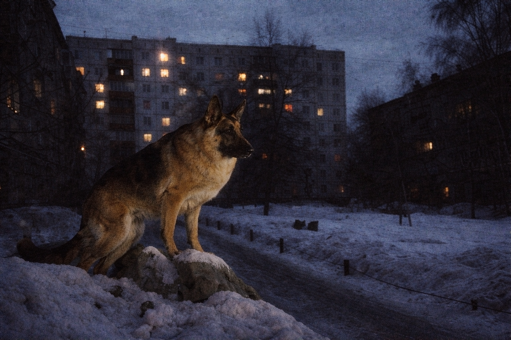

<i>
Ведь больше нет никого<br>
Ничего-ничего<br>
Смерть подставит плечо<br>
Жизнь выставит счет<br>
И за дверь<br>
Ты уходишь<br>
И вроде бы и не жил<br>
Лишь только снег кружит<br>
</i>
<br clear="right"/>

<video src="https://github.com/user-attachments/assets/193315b6-0143-4289-bbbd-fdb28540fec4"></video>

## (not only) cheburnet

##### ubuntu server init
```sh
bash <(wget -qO- https://raw.githubusercontent.com/vargalott/cheburnet/refs/heads/main/init-ubuntu.sh) "<ssh_key>" "<cert_email>" "<cert_domain>"
```

##### check tools
```sh
ssh -p <port> user@host -L <local_port>:127.0.0.1:<remote_port>

bash <(wget -qO- ip.check.place) -l en
bash <(wget -qO- check.unlock.media) -E en -R 0
bash <(wget -qO- bench.sh)
bash <(wget -qO- nws.sh)
bash <(wget -qO- https://raw.githubusercontent.com/vernette/censorcheck/refs/heads/master/censorcheck.sh)
bash <(wget -qO- https://raw.githubusercontent.com/vernette/ipregion/refs/heads/master/ipregion.sh)
```

##### misc
```sh
echo "$(tr -dc a-z </dev/urandom | head -c2)$((RANDOM%9+1))--$(tr -dc a-z0-9 </dev/urandom | head -c13)-$( ( [ $((RANDOM%2)) -eq 0 ] && printf '%02d' $((RANDOM%90+10)) ) || echo $(tr -dc a-z </dev/urandom | head -c1)$((RANDOM%9+1)) )"
uuidgen
docker run ghcr.io/sagernet/sing-box:latest generate reality-keypair

docker network create --driver bridge --subnet=172.20.0.0/24 --gateway=172.20.0.1 localnet

certbot certonly --standalone --agree-tos -m EMAIL -d DOMAIN
certbot renew --dry-run

rsync -avz --delete -e ssh host:/root/vaultwarden/data $HOME/backups/vaultwarden/
```
